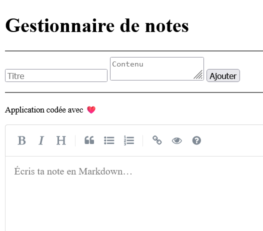

# gestion-notes

Mini-application web en **PHP procédural avec PDO** pour **créer / lister / rechercher / supprimer** des notes.  
Stockage via **SQLite**. Interface d’édition **Markdown (SimpleMDE)** avec rendu sécurisé côté client.

## ✨ Fonctionnalités

- Ajouter une note (**titre**, **contenu Markdown**, **date de création**)
- Lister toutes les notes (titre, extrait/rendu, date)
- Supprimer une note
- **Recherche** (filtre par titre ou contenu)
- Séparation stricte du code : **models / views / controllers**
- Sécurité :
  - Requêtes **PDO préparées**
  - **htmlspecialchars** à l’affichage brut
  - Rendu Markdown → HTML via **marked** + **DOMPurify** (XSS-safe)

## 🧱 Stack & prérequis

- **PHP ≥ 8.0** (avec extension **PDO** et **pdo_sqlite**)
- **SQLite 3**
- Navigateur moderne (CDN pour SimpleMDE, marked, DOMPurify)

## 📁 Arborescence

```
gestion-notes/
│── index.php
│── database.sql
│
├── models/
│   ├── db.php
│   └── noteModel.php
│
├── controllers/
│   └── noteController.php
│
├── views/
│   ├── header.php
│   ├── footer.php
│   ├── notes.php
│   └── form.php
│
└── public/
```




## 🗄️ Base de données

Schéma minimal (fourni dans `database.sql`) :

```sql
CREATE TABLE IF NOT EXISTS notes (
  id INTEGER PRIMARY KEY AUTOINCREMENT,
  title TEXT NOT NULL,
  content TEXT NOT NULL, -- Markdown stocké tel quel
  created_at DATETIME DEFAULT CURRENT_TIMESTAMP
);

